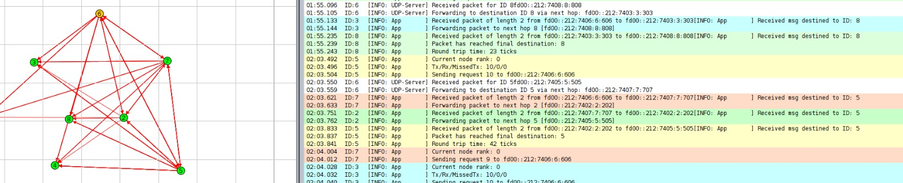

# Contiki-NG: The OS for Next Generation IoT Devices

[](https://github.com/contiki-ng/contiki-ng/actions)
[](https://contiki-ng.readthedocs.io/en/master/?badge=master)
[](https://github.com/contiki-ng/contiki-ng/blob/master/LICENSE.md)
[](https://github.com/contiki-ng/contiki-ng/releases/latest)
[](https://github.com/contiki-ng/contiki-ng/releases/latest)
[](https://github.com/contiki-ng/contiki-ng/commit/HEAD)

[](https://stackoverflow.com/questions/tagged/contiki-ng)
[](https://gitter.im/contiki-ng)
[](https://twitter.com/contiki_ng)

Contiki-NG is an open-source, cross-platform operating system for Next-Generation IoT devices. It focuses on dependable (secure and reliable) low-power communication and standard protocols, such as IPv6/6LoWPAN, 6TiSCH, RPL, and CoAP. Contiki-NG comes with extensive documentation, tutorials, a roadmap, release cycle, and well-defined development flow for smooth integration of community contributions.

Unless explicitly stated otherwise, Contiki-NG sources are distributed under
the terms of the [3-clause BSD license](LICENSE.md). This license gives
everyone the right to use and distribute the code, either in binary or
source code format, as long as the copyright license is retained in
the source code.

Contiki-NG started as a fork of the Contiki OS and retains some of its original features.

### Abstract

With the increasing prevalence of IoT devices, low-power and lossy networks (LLNs) have become integral to many applications. One commonly used routing protocol in these networks is the RPL (Routing Protocol for Low-Power and Lossy Networks). However, RPL is vulnerable to various security threats, particularly wormhole attacks, where two or more malicious nodes collude to create a tunnel, forwarding packets between distant network points. This attack disrupts normal routing, increases delays, and may even lead to network partitioning.

In this project, we developed a simulation of a wormhole attack within an IoT network using the Contiki-NG operating system and the Cooja simulator. The goal was to demonstrate the impact of a wormhole attack on RPL-based networks and to propose a method to detect such attacks without the need for additional hardware. Our detection approach involves monitoring the network for abnormal packet forwarding patterns and measuring discrepancies in the expected round-trip times of packets. Identifying these anomalies can help us locate the wormhole nodes and mitigate the impact of the attack.

The results of our implementation show that it is feasible to detect wormhole attacks in resource-constrained IoT environments using software-based techniques. This is significant as it enhances the security of IoT networks without requiring additional infrastructure, thus providing a cost-effective solution to protect low-power, lossy networks from malicious interference.

### Literature review 

The paper "A Novel Detection and Localization Scheme for Wormhole Attack in Internet of Things" proposes a novel detection and localization scheme specifically designed to identify and locate wormhole attacks in Internet of Things (IoT) networks. The main contribution is the development of a lightweight, energy-efficient, and accurate mechanism that addresses the challenges of detecting wormhole attacks in resource-constrained IoT environments.

The authors introduced a detection scheme that is energy-efficient and designed to operate within the limitations of typical IoT devices. This is especially important because IoT devices are often battery-powered and have limited processing capabilities, which can hinder the implementation of complex security mechanisms. Thus, a solution that minimizes computational overhead while effectively detecting attacks is crucial for the practical deployment of IoT networks.

The detection scheme is based on analyzing the timing and distance between packets sent within the network. By observing the Time-to-Live (TTL) field in the packet headers, the scheme can identify unusual behaviors or discrepancies caused by the wormhole tunnel. The TTL value is an effective measure because wormhole attacks often result in abnormal packet forwarding behavior, causing discrepancies in the TTL values as packets travel through the malicious tunnel, bypassing the normal routing path.

### Implementation of the Attack

The wormhole attack was implemented using the Contiki-NG operating system and the Cooja network simulator, which provides a visual and interactive environment to emulate IoT networks. 

To download and install cooja simulator follow [Step-by-Step: Setup Contiki-NG Cooja IoT Network Simulator on Linux System](https://www.youtube.com/watch?v=a4radETt04U)

The implementation proceeded in two phases: first, we set up a baseline (normal) topology consisting entirely of legitimate nodes, and second, we simulated the wormhole attack by reconfiguring two specific nodes (nodes 7 and 8) as malicious.

The topologies are as follows 

<p>
    
    
</p>

- **Node 6**: Acts as the *Border Router (root node)*. It connects the internal IoT network to the external Internet (represented by a cloud symbol).

- **Nodes 1, 2, 3, 4 and 5**: These are all *normal UDP client nodes*, responsible for sensing and forwarding data within the network.

- **Nodes 7 and 8**: These are *normal UDP client nodes* in the normal simulation, and act as wormhole nodes which intercept and modify the packets and forward the packets to each other in the wormhole simulation.

The codes for the normal and wormhole nodes can be found in the [rpl-udp folder](examples/rpl-udp)

To run the wormhole simulation do the following 
```
cd examples/rpl-udp
export PATH=/usr/local/msp430/bin/:$PATH
make udp-client TARGET=sky
make udp-server TARGET=sky
make wormhole_node1 TARGET=sky
make wormhole_node2 TARGET=sky

cd ../..
cd tools/cooja
./gradlew run
```
And open the simulation [Wormhole simulation.csc](examples/rpl-udp/Wormhole-v8.csc)

To run the normal simulation do the following 
```
cd examples/rpl-udp
export PATH=/usr/local/msp430/bin/:$PATH
make udp-client-normal TARGET=sky
make udp-server-normal TARGET=sky

cd ../..
cd tools/cooja
./gradlew run
```
And open the simulation [Normal simulation.csc](examples/rpl-udp/Normal-v1.csc)


### Detection of the Attack
To detect the presence of a wormhole attack in the simulated network, we used a comparative approach between two scenarios: a normal topology simulation (without wormhole nodes) and a wormhole-injected simulation.

We logged packet send and acknowledgment times across all nodes in both scenarios (normal and wormhole). These logs were then used to calculate and compare RTTs. Anomalies in RTT—particularly consistently higher delays—served as indirect evidence of the presence of a wormhole.

RTT calculation is done as follows 
```
if(msg.dest_id == my_id) {
    LOG_INFO("Packet has reached final destination: %u\n", msg.dest_id);
    response_time = clock_time(); // Timestamp when response is received
    round_trip_time = response_time - send_time; // Calculate round trip time
    LOG_INFO("Round trip time: %" PRIu32 " ticks\n", round_trip_time);
    return; // Do nothing; we are the destination
}
```

### Results and Analysis

The simulation outputs of wormhole simulation and normal simulation are as follows

<p>
    
    
</p>

In our simulation, we measured the Round Trip Time (RTT) for communication between Node 5 and the server (presumably Node 6). The observed RTT values were:

- **Normal Simulation: 42 ticks**

- **Wormhole Simulation: 80 ticks**

This 90% increase in RTT in the presence of the wormhole attack is significant and counterintuitive at first glance. A wormhole typically creates a shortcut between distant nodes, which would ideally reduce hop count and potentially RTT. However, in our simulation, the following factors contributed to the increased RTT:

- **Tunneling Overhead**: The wormhole nodes act as intermediaries that capture, encapsulate, and forward packets through an artificial link. This adds extra processing delay compared to normal multi-hop forwarding.

- **Lack of True Physical Layer Optimization**: Unlike real wormholes that exploit fast physical links, the simulated wormhole operates at a higher abstraction layer (e.g., application or transport), introducing additional software-level delays.

- **Packet Modification or Buffering**: The malicious nodes may buffer, modify, or delay packets to simulate tunnel behavior, which further increases the time taken for a full round trip.

- **Bypassing Natural Routing Efficiency**: In some cases, the normal topology may actually provide a more optimized route based on RPL (Routing Protocol for Low-Power and Lossy Networks). The artificial shortcut may bypass these routes, but at the cost of increased latency. It can be seen that in the wormhole simulation the node 7 is forwarding the packet to node 8 and then it is being forwarded to 5 causing it to go in a cyclic manner to the node 5 without following the optimized route as given in the normal simulation.
